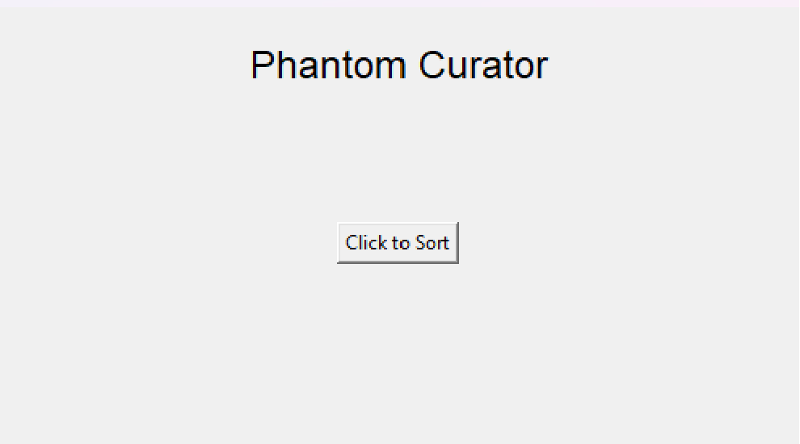

:warning: Everything between << >> needs to be replaced (remove << >> after replacing)

#  Phantom Curator
## CS110 Final Project   Fall, 2023 

## Team Members

Hamid Ajose and Aidan Gonzalez

***

## Project Description

 A file sorting python script that sorts files and relates to the user the last time files in a directory were opened, and how they were sorted the last time the application was run.

***    

## GUI Design 

### Initial Design

### Final Design

## Program Design

### Features

1. curates files into subdirectories based on their file extension
2. user inputted pathing in the GUI 
3. a log file to track movement of files done by the curate function
4. buttons in the gui to engage the curate function and to open the log file
5. creates folders for the sorted files to be placed into

### Classes

PhantomCurator: Contains the curate function which curates the files selected by the user into seperate folders based off of the curator_dictionary and contains the log_file_movement which allows for the movement of the files to be logged into the Enchiridion.txt file for the user to see
Controller: contains the GUI of the program with directions and buttons to engage the curate() function and a button for opening the Enchridion.txt file. Also has a textbox that allows for user inputted file pathing to direct the curate() function

## ATP
/ Acceptance Test Procedure List for PhantomCurator /

 1. Test: Curate Files by Extension
- Test Description: Verify that the script accurately curates files into designated directories based on their extensions.
- Test Steps:
  1. make a directory with files that have various extensions (the ones listed in the     
     self.curator_extension_directories dictionary) 
  2. Run the script with the directory above. 
- Expected Outcome: Files should be moved to the appropriate directories based on their extensions, and the log file ("Enchiridion.txt") should contain accurate entries for each file movement.

  2. Test: Curate Files by Size
- Test Description: Makes sure the script correctly sorts files into the right directories based on their file size.
- Test Steps:
  1. make a directory with files of various sizes ranging from kb, to mb, to even gb if you can.
  2. Run the script with the specified file path.
- Expected Outcome: Files will be moved to the right directories (small, medium, large) based on their sizes. The log file ("Enchiridion.txt") will contain accurate entries for each file movement.

 3. Test: Log File Content
- Test Description: make sure the log file (enchiridion.txt) has correctly timestamped and accurate information on file movements.
- Test Steps:
  1. make a directory with files of various sizes or extensions.
  2. Run the script with the specified file path, making sure to use the log_file_movement() method.
- Expected Outcome: The log file ("Enchiridion.txt") should contain timestamped entries for each file, including the file name, source path, and destination path. Each entry should be separated by a line of equal signs.

 4. Test: Existing Directory Handling
- Test Description: Test the script's behavior when the curated directories already exist.
- Test Steps:
  1. Create subdirectories corresponding to curated categories (e.g., Documents_Curated, Images_Curated).
  2. Place files of various sizes and extensions in the main directory.
  3. Run the script with the specified file path.
- Expected Outcome: The script should handle existing directories, moving files to the appropriate subdirectories without errors.

 5. Test: Unsupported File Types
- Test Description: Ensure that the script ignores files with unsupported extensions.
- Test Steps:
  1. Add files with extensions not listed in `curator_extension_directories` to the directory.
  2. Run the script with the specified file path.
- Expected Outcome: Unsupported files should remain in the main directory, and the script should not throw errors for these files.

 6. Test: Script Execution Time (Optional)
- Test Description: Evaluate the execution time of the script with a large number of files.
- Test Steps:
  1. Generate a significant number of files in the specified directory.
  2. Run the script.
- Expected Outcome: The script should complete execution within a reasonable time frame, considering the size of the file collection.
